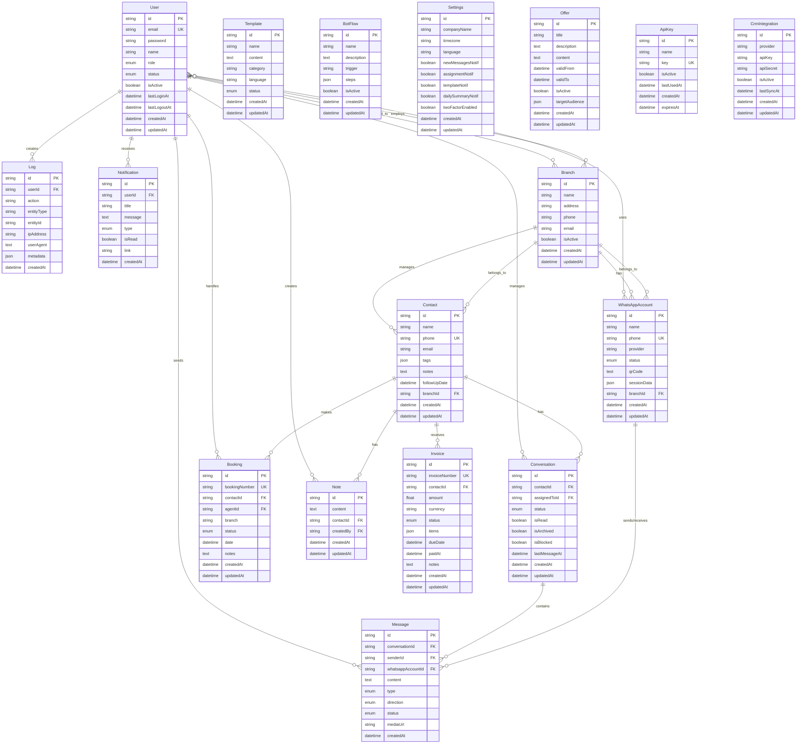
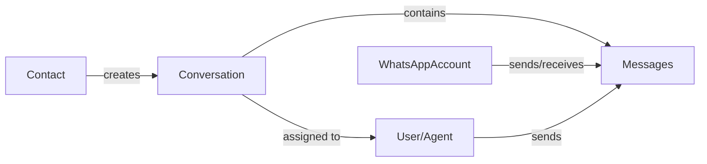
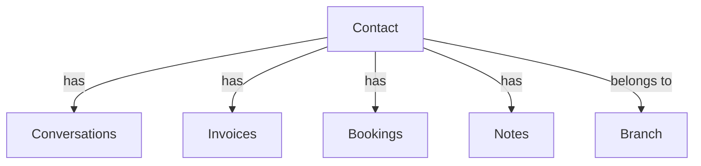
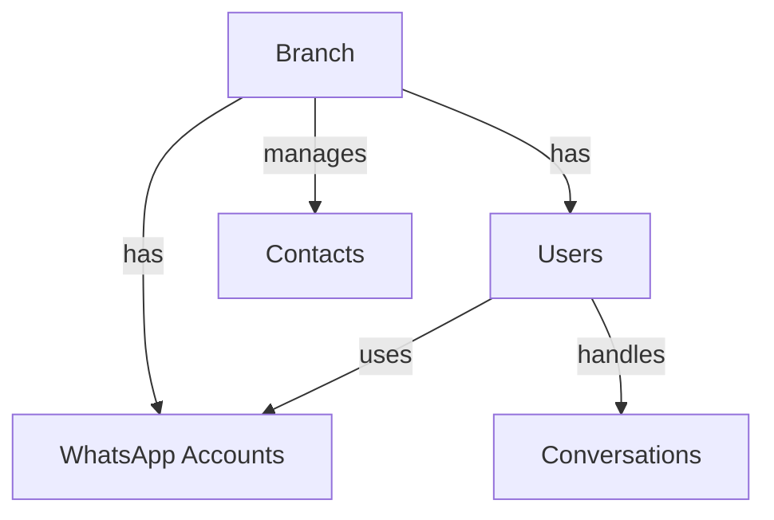
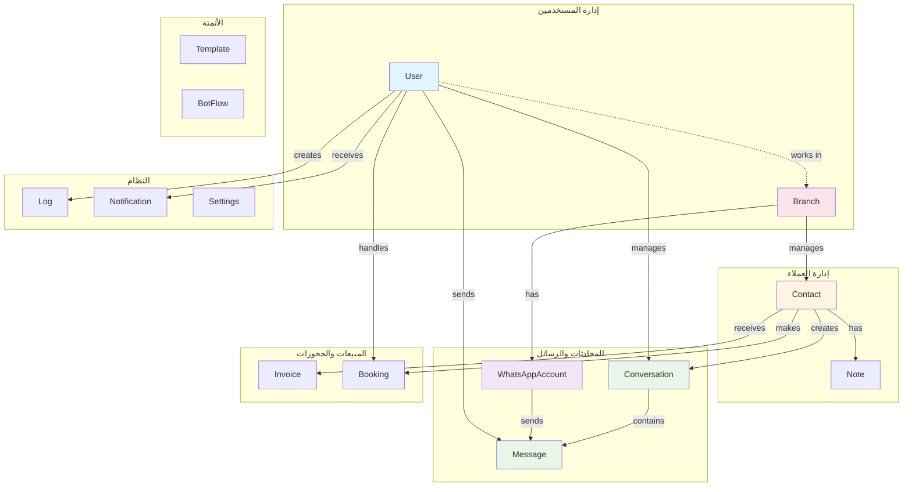

# 📊 مخطط قاعدة بيانات Meras CRM - ERD

## 🎯 Entity Relationship Diagram



---

## 🔗 العلاقات الرئيسية

### 1️⃣ دورة المحادثة (Conversation Flow)



**الشرح**: 
- العميل (`Contact`) ينشئ محادثة
- المحادثة تُسند لوكيل (`User`)
- الرسائل تُرسل عبر حساب واتساب (`WhatsAppAccount`)

---

### 2️⃣ إدارة جهات الاتصال (Contact Management)



**الشرح**:
- كل عميل يمكن أن يكون له:
  - محادثات متعددة
  - فواتير
  - حجوزات
  - ملاحظات داخلية
- العميل مرتبط بفرع محدد

---

### 3️⃣ البنية التنظيمية (Organization Structure)



**الشرح**:
- كل فرع له موظفين وحسابات واتساب خاصة
- الموظفون يستخدمون حسابات الواتساب لإدارة المحادثات

---

## 📈 إحصائيات قاعدة البيانات

| النوع | العدد | الوصف |
|------|------|-------|
| **الجداول الرئيسية** | 8 | User, Contact, Conversation, Message, WhatsAppAccount, Branch, Invoice, Booking |
| **الجداول المساعدة** | 7 | Note, Template, BotFlow, Log, Notification, Settings, Offer |
| **جداول التكامل** | 2 | ApiKey, CrmIntegration |
| **إجمالي الجداول** | 17 | - |
| **العلاقات (Relations)** | 23 | One-to-Many & Many-to-Many |
| **الفهارس (Indexes)** | 18 | لتحسين الأداء |

---

## 🎨 العلاقات حسب النوع

### One-to-Many (1:N)

```
User          → Messages (1 user → many messages)
User          → Conversations (1 user → many conversations)
User          → Notifications (1 user → many notifications)
Contact       → Conversations (1 contact → many conversations)
Contact       → Invoices (1 contact → many invoices)
Contact       → Bookings (1 contact → many bookings)
Conversation  → Messages (1 conversation → many messages)
Branch        → Contacts (1 branch → many contacts)
Branch        → WhatsAppAccounts (1 branch → many accounts)
```

### Many-to-Many (N:M)

```
User ←→ Branch (user can work in multiple branches)
User ←→ WhatsAppAccount (user can use multiple accounts)
```

---

## 🔍 نقاط الوصول الرئيسية (Key Access Patterns)

### 1. جلب محادثات صندوق الوارد

```typescript
// الاستعلام الأكثر استخداماً
Contact → Conversation → Message → User (assigned agent)
```

**الفهارس المستخدمة**:
- `Conversation.contactId` ✅
- `Conversation.assignedToId` ✅
- `Message.conversationId` ✅

---

### 2. تتبع رسائل حساب واتساب

```typescript
WhatsAppAccount → Message → Conversation → Contact
```

**الفهارس المستخدمة**:
- `Message.whatsappAccountId` ✅
- `Message.conversationId` ✅

---

### 3. تقارير الفروع

```typescript
Branch → Users → Conversations → Messages
Branch → WhatsAppAccounts → Messages
Branch → Contacts
```

**الفهارس المستخدمة**:
- `WhatsAppAccount.branchId` ✅
- `Contact.branchId` (مطلوب إضافته) ⚠️

---

## 💡 توصيات التحسين

### 1. إضافة فهارس مفقودة

```sql
-- Contact.branchId للفلترة حسب الفرع
CREATE INDEX idx_contact_branch ON Contact(branchId);

-- Message.createdAt للترتيب الزمني
CREATE INDEX idx_message_created ON Message(createdAt);

-- Conversation.lastMessageAt للترتيب
CREATE INDEX idx_conversation_last_message ON Conversation(lastMessageAt);
```

### 2. Soft Delete بدلاً من Hard Delete

```prisma
model Contact {
  // ...
  deletedAt DateTime?
  
  @@index([deletedAt]) // للفلترة السريعة
}
```

### 3. Partitioning للجداول الكبيرة

```sql
-- تقسيم جدول Message حسب الشهر
PARTITION BY RANGE (YEAR(createdAt) * 100 + MONTH(createdAt))
```

---

## 🚀 سيناريوهات الاستخدام

### سيناريو 1: وكيل يفتح محادثة

```
1. User logs in → check User.isActive
2. Load assigned conversations → Conversation (assignedToId = userId)
3. Display conversation list → include Contact, last Message
4. User opens conversation → load all Messages
5. User sends reply → create new Message (direction: OUTGOING)
6. Update Conversation.lastMessageAt
```

### سيناريو 2: رسالة واتساب جديدة واردة

```
1. WhatsApp webhook → identify WhatsAppAccount by phone
2. Find or create Contact → by phone number
3. Find or create Conversation → by contactId
4. Create Message → (direction: INCOMING)
5. Update Conversation (isRead: false, lastMessageAt)
6. Create Notification → for assigned User
7. Run BotFlow → if trigger matches
```

### سيناريو 3: إنشاء فاتورة لعميل

```
1. Find Contact → by phone or name
2. Create Invoice → link to contactId
3. Send invoice via WhatsApp → create Message with DOCUMENT
4. Create Notification → notify assigned agent
5. Log action → create Log entry
```

---

## 📝 ملاحظات مهمة

1. **UUID vs Auto-increment**:
   - جميع الجداول تستخدم UUID للـ Primary Key
   - يساعد في التوزيع والدمج المستقبلي

2. **Cascade Delete**:
   - `Contact → Conversation → Message` (cascade)
   - `Contact → Invoice` (cascade)
   - `Contact → Booking` (cascade)
   - حذف العميل يحذف كل بياناته المرتبطة

3. **Soft Relations**:
   - `User → Conversation` (onDelete: SetNull)
   - `User → Message` (onDelete: SetNull)
   - حذف المستخدم لا يحذف البيانات، فقط يفك الارتباط

4. **JSON Fields**:
   - `Contact.tags` → مصفوفة وسوم مرنة
   - `BotFlow.steps` → خطوات السير الآلي
   - `Invoice.items` → بنود الفاتورة
   - `Settings.*` → إعدادات مرنة

---

## 🎯 خريطة التدفق الكاملة



---

**تم الإنشاء بتاريخ**: 18 يناير 2026  
**الإصدار**: 1.0  
**قاعدة البيانات**: MySQL with Prisma ORM

---

## 📖 كيفية عرض المخطط

### في GitHub / GitLab
الملف سيُعرض تلقائياً مع Mermaid rendering

### في VS Code
1. تثبيت إضافة: `Markdown Preview Mermaid Support`
2. فتح الملف والضغط `Ctrl+Shift+V` للمعاينة

### في أدوات أخرى
- نسخ كود Mermaid في [mermaid.live](https://mermaid.live/)
- استخدام [draw.io](https://app.diagrams.net/) لتحويله لـ PNG/SVG

---

## 🔗 مراجع

- [Prisma Schema](./prisma/schema.prisma)
- [Database Schema Docs](./DATABASE-SCHEMA.md)
- [API Documentation](./API-DOCUMENTATION.md)
